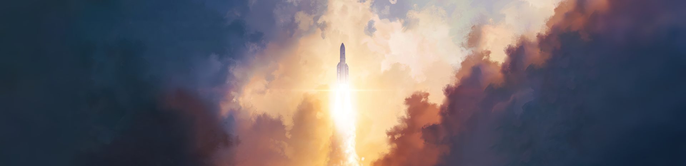

# Hey there! 👋

`Astronomy` `Science` `Technology` `Music` `Traveling`

I'm Darian, a full-stack developer with a passion for mobile and machine learning. Being able to support the next generation and progress are things that capture my attention. I work on random assignments in my free time and enjoy new, innovative, and difficult assignments!

---

### ✅ Language tools

<!-- Mobile & Machine Learning FUTURE -->

    

### ✅ My GitHub Statistics

### ✅ My Programming Languages

